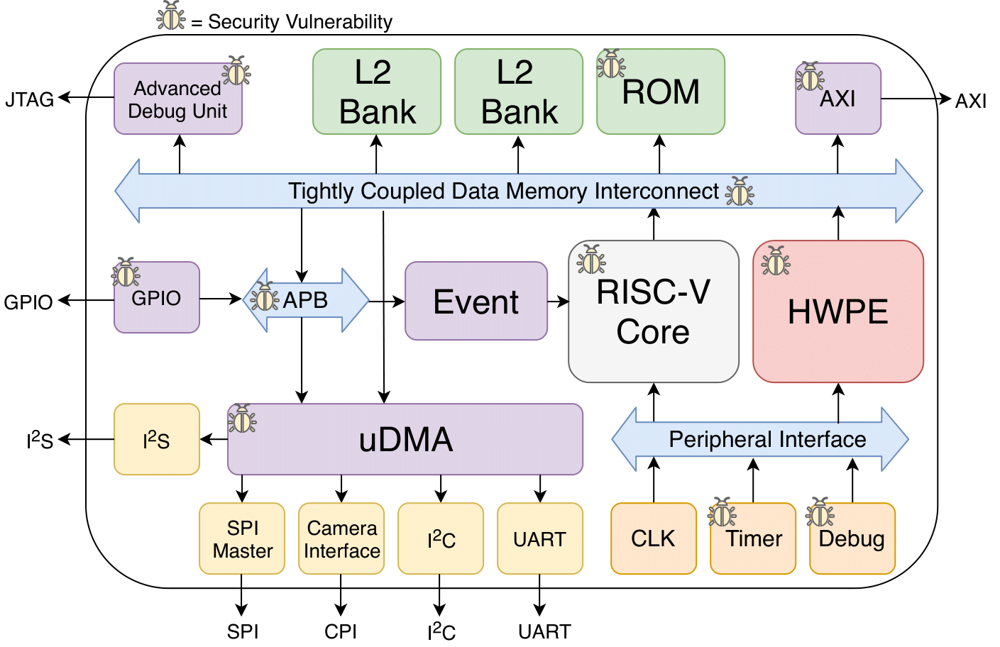

# Hack@DAC 2018 Phase 2 Buggy SoC

SoC used for the second phase of the 2018 Hack@DAC hardware security competition (https://hack-dac18.trust-sysec.com/). 
This SoC is a modified version of the PULPissimo SoC, which was created by ETH Zurich and the
University of Bologna (https://github.com/pulp-platform/pulpissimo). A collobaration of researchers at Texas A&M University, 
Technische Universität Darmstadt, and Intel expanded the PULPissimo SoC by adding additional security features and inserting 
hardware security bugs.  

## Bugs
The following bugs were inserted into the SoC:

| #  | Bug                                                                                               | 
|----|---------------------------------------------------------------------------------------------------|
|  1 |Address range overlap between peripherals SPI Master and SoC.                                      |
|  2 |Addresses for L2 memory is out of the specified range.                                             |
|  3 |Processor assigns privilege level of execution incorrectly from CSR.                               |
|  4 |Register that controls GPIO lock can be written to with software.                                  |
|  5 |Reset clears the GPIO lock control register.                                                       |
|  6 |Incorrect address range for APB allows memory aliasing.                                            |
|  7 |AXI address decoder ignores errors.                                                                |
|  8 |Address range overlap between GPIO, SPI, and SoC control peripherals.                              |
|  9 |Incorrect password checking logic in debug unit.                                                   |
| 10 |Advanced debug unit only checks 31 of the 32 bits of the password.                                 |
| 11 |Able to access debug register when in halt mode.                                                   |
| 12 |Password check for the debug unit does not reset after successful check.                           |
| 13 |Faulty decoder state machine logic in RISC-V core results in a hang.                               |
| 14 |Incomplete case statement in ALU can cause unpredictable behavior.                                 |
| 15 |Faulty logic in the RTC causing inaccurate time calculation for security-critical flows, e.g., DRM.|
| 16 |Reset for the advanced debug unit not operational.                                                 |
| 17 |Memory-mapped register file allows code injection.                                                 |
| 18 |Non-functioning cryptography module causes DOS.                                                    |
| 19 |Insecure hash function in the cryptography module.                                                 |
| 20 |Cryptographic key for AES stored in unprotected memory.                                            |
| 21 |Temperature sensor is muxed with the cryptography modules.                                         |
| 22 |ROM size is too small preventing execution of security code.                                       |
| 23 |Disabled the ability to activate the security-enhanced core.                                       |
| 24 |GPIO enable always high.                                                                           |
| 25 |Unprivileged user-space code can write to the privileged CSR.                                      |
| 26 |Advanced debug unit password is hard-coded and set on reset.                                       |
| 27 |Secure mode is not required to write to interrupt registers.                                       |
| 28 |JTAG interface is not password protected.                                                          |
| 29 |Output of MAC is not erased on reset.                                                              |
| 30 |Supervisor mode signal of a core is floating preventing the use of SMAP.                           |
| 31 |GPIO is able to read/write to instruction and data cache.                                          |

## Getting Started
To install the SoC, please follow the steps listed in the PULPissimo readme (https://github.com/pulp-platform/pulpissimo/blob/master/README.md).

## Support & Questions
For any issues with the SoC or any questions, please add an issue to our issue tracker.

